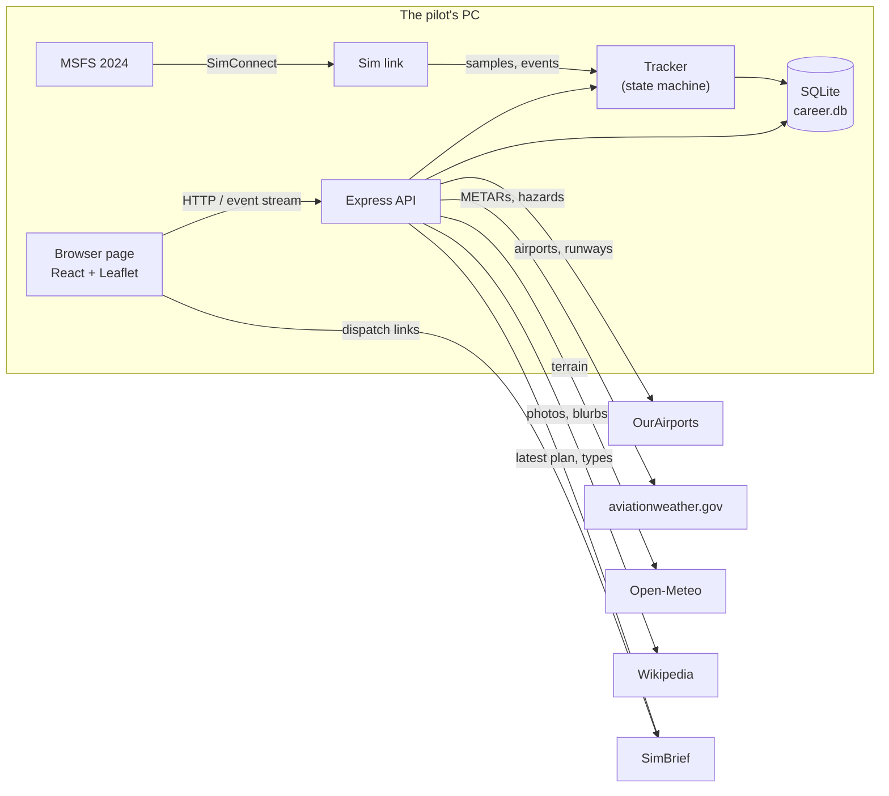
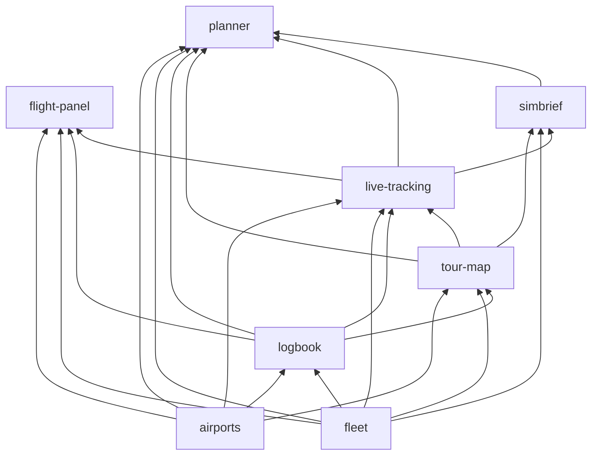

# High-Level Design: MSFS Career Map

## Problem

MSFS 2024 has no persistent career of the kind this project's pilot flies: every aircraft + livery
always starts where it last parked, so each one builds its own tour, and study-level add-ons (such
as A2A's) keep wear and failures per livery. With several tours running at once, it is hard to keep
track of where each aircraft is, where it has been and when, how each flight went, and where it can
go next. Ready-made career programs bring their own rules, economy and accounts; this career wants
none of that, only a faithful record of what was flown.

## Approach

A local, map-first logbook that the sim fills in by itself.

- **The career is a set of tours.** The unit is an aircraft + livery. Its hops are chained in
  order, and where it is parked is simply the destination of its last hop — nothing to keep in sync.
- **The map is the main view.** Every tour is drawn where it was flown — the real recorded track
  when there is one — with where each aircraft is parked and when each airport was visited.
- **The sim logs the flights.** With MSFS running, a takeoff and a landing become a hop on their
  own, with the flown track, a rated landing, a flight profile and fuel figures. When the app cannot
  tell something (which aircraft, which airport), it keeps the leg for the user to finish rather
  than guessing. Hops can always be logged and corrected by hand too.
- **Planning hands off.** The app answers "where can this aircraft go next within N minutes?", with
  live weather and darkness flagged; SimBrief does the real flight planning, and its plan comes back
  to be kept with the flight.
- **Free, public data.** Airports and runways from OurAirports, weather from aviationweather.gov,
  terrain from Open-Meteo, photos and blurbs from Wikipedia — no accounts or keys.

## Target Users

One sim pilot running their own career on their own PC. They fly sessions with the sim and the app
side by side, want logging to take no effort, plan the next hop between flights, and look back at
flights afterwards. They are comfortable starting a local Node app and occasionally reading a log, but should not need to touch the database or the code to use it.

## Goals

- Every flight flown with the sim connected ends up in the logbook, or waiting for the pilot to
  finish or discard it — never silently lost, not even across a server restart or a sim crash.
- At a glance: where every aircraft is parked, the tour each has flown, and when each airport was
  visited.
- Choosing the next hop takes one search, with unusable airports filtered and doubtful ones flagged.
- Any tracked flight can be examined afterwards: profile, landing, distance, fuel, and the plan it
  was flown from.
- Hand-logged history is first-class: hops from before tracking, or flown without the app, sit in
  the same tours.

## Non-Goals

- **Restricting where the pilot can fly** — no career feature, now or later, limits destinations or
  refuses a flight. The app records the career; the pilot runs it.
- **An economy, for now** — no jobs, income or passengers to earn. A realistic running cost per
  tour (fuel and maintenance spent) is a possible later addition, deliberately deferred; hops
  already record the fuel each tracked flight used.
- **A flight planner** — no routes, winds or fuel planning beyond choosing a destination; SimBrief
  does that.
- **More than one user or machine** — no accounts, hosting or sync.
- **Other simulators** — MSFS 2024 is the target; MSFS 2020 works without liveries.
- **Tracking aircraft wear or maintenance** — the add-ons that model it keep it themselves.

## Tenets

In order; when two conflict, the higher one wins.

- **Never lose a flight.** When a choice risks losing something the pilot flew or logged, keep it
  and let the pilot discard it.
- **Record, don't police.** The app records the career as flown; it may warn, or one day count the
  cost, but it never refuses a flight or limits where the pilot can fly.
- **Hand off to the specialists.** Where a dedicated tool already does a job well — SimBrief for
  planning, add-ons for wear, the sim for flight data — integrate with it rather than rebuild it.
- **Keyless and local.** Prefer a free, keyless source and local storage over a better service that
  needs an account or a key.

## System Design

One Node process serves the API and the page and runs the tracker; the browser is the interface.
The sim link only turns SimConnect into samples and events; the tracker is a sim-independent state
machine fed one sample at a time and checkpointed to the database, so a synthetic feed can drive it
and a restart loses nothing.

### Segments

Each segment has a low-level design and EARS specs under `docs/intent/<segment>/`, and an arrow doc
under `docs/arrows/`.

| Segment | Prefix | Owns |
|---|---|---|
| [logbook](intent/logbook/logbook-design.md) | `LOG` | Hops: the record, order and parked position, the hop form and lists, correcting tracked hops |
| [fleet](intent/fleet/fleet-design.md) | `FLEET` | Aircraft + livery: performance and limits, color and icon, sim binding fields, the aircraft form |
| [airports](intent/airports/airports-design.md) | `APT` | OurAirports data and its monthly refresh, code lookup, nearest airport, the airport popup, METARs, Wikipedia |
| [tour-map](intent/tour-map/tour-map-design.md) | `MAP` | The map: geometry and world copies, tours, airport dots, parked markers, highlight and zoom, night and hazard overlays |
| [planner](intent/planner/planner-design.md) | `PLAN` | Block-time model, reachable-airport search, weather and darkness flags, terrain check, the planner card and layers |
| [live-tracking](intent/live-tracking/live-tracking-design.md) | `LIVE` | Sim link, leg detection, airport naming, landings and ratings, logging and pending legs, the live card and layer |
| [flight-panel](intent/flight-panel/flight-panel-design.md) | `PANEL` | One flight under the map: profile chart, landing and flight cards, how ratings look |
| [simbrief](intent/simbrief/simbrief-design.md) | `SB` | Dispatch links, type list, importing and keeping plans, the SimBrief card and route |
| [app-shell](intent/app-shell/app-shell-design.md) | `APP` | Server, data locations, API conventions, page layout, shared formatting, scripts and launcher |

An arrow points from a segment to one that relies on it (`docs/arrows/index.yaml` lists them all).
app-shell sits under everything and is left out.

### Rules every segment follows

- **Identity.** A fleet aircraft is a name + livery; a sim aircraft is matched to it by the sim's
  title + livery, a blank livery meaning any.
- **Order and position.** Hops are ordered per aircraft by a contiguous sequence the server
  renumbers; an aircraft is parked at its highest-sequence hop's destination, derived, never stored.
- **Airport codes** are resolved to the canonical OurAirports ident before storage; an airport a hop
  uses is never lost from the data.
- **Time.** Stored as ISO 8601 UTC, shown in the browser's local time. A hop records the real-world
  clock and the sim's clock; flight time leaves out time the sim was paused.
- **Map geometry** — paths, world copies, parked positions, zoom points — is computed in one place
  (`paths.ts`) and shared by every layer.
- **The server decides, the page shows.** Landing ratings, hard planner filters and code resolution
  happen on the server; the page maps results to how they look.
- **Schema changes are additive** and upgrade an existing database in place.

## Key Design Decisions

| Decision | Chosen | Alternatives | Why |
|---|---|---|---|
| Shape of the app | One local Node process, SQLite file, browser UI | Desktop app; hosted service | Nothing to host or sign into; the sim link needs a process on the same PC; one file to back up. |
| Unit of the career | Aircraft + livery, hops chained per aircraft, parked position derived | Free-standing flights; a stored "current location" | Matches how the career is flown and how add-ons persist wear; a derived position cannot drift. |
| Tracker design | A sim-independent state machine fed samples, checkpointed every few seconds | Logic inside the SimConnect callbacks | Testable with a synthetic feed; survives restarts. |
| When unsure | Keep the leg as pending with the reason; the pilot finishes or discards it | Guess; drop | Nothing guessed into the logbook, nothing flown lost. |
| Data sources | Free, keyless public sources, cached locally | Commercial or keyed APIs | No sign-ups or keys for a local hobby tool. |
| Planning | Choose the destination here; plan the flight in SimBrief and import the plan | Build route, wind and fuel planning in | SimBrief already does it well. |
| Spec IDs | `PREFIX-FACET-NNN`, one prefix per segment | Global numbering | IDs say where they belong and survive reordering. |
| Testing | Vitest for the logic (tracker, geometry, block-time model, OFP parsing) and for the API against a temporary database; component tests with Testing Library for UI specs; a few Playwright browser tests for the main flows (log a hop, a `sim-fake` flight, plan → Use). Tests cite the spec IDs they verify and are written before the code that closes a gap. | Logic only; logic plus component tests, UI checked by hand | Much of the app's value lies in flows that cross the tracker, the server and the page; the synthetic sim feed makes a whole tracked flight testable without the sim. |

## Success Metrics

The project is broken when any of these happens:

- A flight flown with the sim connected appears neither as a hop nor as a pending leg.
- A server restart or a sim crash in flight loses the leg being flown.
- The map shows an aircraft parked anywhere but its last hop's destination, or a hop's path not
  meeting its airport dots.
- A planner result offers an airport the aircraft cannot use (runway, surface, elevation) or hides
  one that live weather does not rule out.
- Logging a normal flight needs anything from the pilot beyond binding a new sim aircraft once.

## References

- [README.md](../README.md) — user-facing description, API table, roadmap
- [CLAUDE.md](../CLAUDE.md) — project notes and LID directives
- [docs/arrows/index.yaml](arrows/index.yaml) — segment status and dependencies
- External: OurAirports, aviationweather.gov, Open-Meteo, Wikipedia REST API, SimBrief, SimConnect
  via node-simconnect
